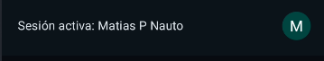

# 📦 DespachoAiep — App Móvil para Cálculo de Despacho Automatizado

Aplicación Android desarrollada con Jetpack Compose y Firebase, orientada a automatizar el cálculo
de despacho para una empresa distribuidora de productos alimenticios. La app permite seleccionar
productos, calcular tarifas dinámicas según monto y distancia, validar condiciones de transporte
para productos congelados y gestionar la sesión del usuario mediante autenticación con Gmail.

---

---
## 🚀 Características principales

- 🔐 Autenticación con cuenta Gmail usando FirebaseAuth
- 🛒 Catálogo interactivo de productos con acumulación de montos
- 📍 Cálculo de distancia geográfica con fórmula de Haversine
- ❄️ Validación de temperatura para productos congelados
- 📦 Cálculo automático de tarifas de despacho según reglas de negocio
- 🧩 Arquitectura modular con componentes reutilizables
- 🌐 Instalación y compatibilidad con Android Ore

---

🧱 Tecnologías utilizadas

- Kotlin
- Jetpack Compose
- Firebase Auth
- Firebase Crashlytics
- Navigation Compose
- Coil
- Play Services Location
- SplashScreen API
- Material 3

---

## 📂 Estructura del proyecto

~~~
com.lll.despachoaiep
│
├── presentation
│   ├── home
│   ├── components
│   ├── components.topBar
│   ├── components.bottomBar
│   ├── login.signup
│   └── initial
├── model
├── datos
├── ui.theme
├── utils
~~~

## 📸 Capturas de pantalla

- Catálogo de productos

- Cálculo de despacho con validación

- Imagen de perfil en barra inferior

---

## Instalación
- Clona el repositorio:
~~~
https://github.com/AIEP-FOLDER/DespachoAiep/tree/aiep
~~~

- Abre el proyecto en Android Studio (AGP 8.12.2)

- Sincroniza Gradle y ejecuta en emulador Android Oreo

- Asegúrate de tener configurado Firebase con tu propio google-services.json

---

## 📄 Informe técnico

Este proyecto fue desarrollado como parte de una actividad evaluativa. El informe completo incluye:

- Introducción y contexto
- Desarrollo técnico y decisiones justificadas
- Evidencia de instalación
- Código fuente modularizado
- Conclusión reflexiva
- Bibliografía en formato APA

---
### 📍Registro de Ubicación GPS en Firebase
Esta aplicación registra la ubicación GPS del dispositivo en tiempo real y la almacena en Firebase Realtime Database, junto con los datos del usuario autenticado. Esta funcionalidad cumple con los requisitos de trazabilidad geográfica definidos en la actividad

### Estructura del modelo "UbicacionGps"

~~~kotlin
data class UbicacionGps(
    val latitud: Double = 0.0,
    val longitud: Double = 0.0,
    val timestamp: Long = System.currentTimeMillis(),
    val nombreUsuario: String = "",
    val correo: String = ""
)
~~~

### Escritura en firebase

Cada ubicación se guarda bajo el nodo "ubicaciones/{uid}/{registro}" utilizando una clave única generada por "push()":

~~~kotlin
fun guardarUbicacionEnFirebase(ubicacion: UbicacionGps) {
    val ref = FirebaseDatabase.getInstance().getReference("ubicaciones")
    val uid = FirebaseAuth.getInstance().currentUser?.uid ?: "anonimo"
    ref.child(uid).push().setValue(ubicacion)
}
~~~

### Captura de ubicacion en "DespachoScreen.kt"

La ubicación se obtiene mediante GPS y se calcula la distancia hasta la Plaza de Armas de Puerto Varas. Luego, se guarda en Firebase junto con el nombre y correo del usuario:

~~~kotlin
LaunchedEffect(Unit) {
    obtenerUbicacionActual(
        context = context,
        onSuccess = { location ->
            val distancia = calcularDistanciaHaversine(
                lat1 = location.latitude, lon1 = location.longitude,
                lat2 = -41.317831, lon2 = -72.982737
            )

            distanciaCalculadaKm = distancia
            distanciaKm = "%.2f".format(distancia)
            cargandoUbicacion = false

            val usuario = FirebaseAuth.getInstance().currentUser
            val nombre = usuario?.displayName ?: "Sin nombre"
            val correo = usuario?.email ?: "Sin correo"

            val ubicacion = UbicacionGps(
                latitud = location.latitude,
                longitud = location.longitude,
                nombreUsuario = nombre,
                correo = correo
            )

            guardarUbicacionEnFirebase(ubicacion)
        },
        onError = {
            Log.e("Ubicación [onError]", it)
            cargandoUbicacion = false
        }
    )
}
~~~

### Ejemplo de estructura en firebase

~~~json
"ubicaciones": {
  "uid123": {
    "-NabcXYZ": {
      "latitud": -41.319,
      "longitud": -72.981,
      "timestamp": 1695140000000,
      "nombreUsuario": "Matías Pérez",
      "correo": "matias@example.com"
    }
  }
}
~~~

---
### Acceder al informe completo

https://correoaiep-my.sharepoint.com/:w:/g/personal/matias_perezn_correoaiep_cl/EaTVFe3ts4RHpMe-5E3TsXMBNbCxhcgMHEUrGLcfJc-Xzg?e=qCi0F2

---

### ✉️ Contacto

> Desarrollado por Matías Ignacio Pérez Nauto
>
> 📍 Puerto Varas, Chile
>
> 📧 contacto@mtsprz.org
> 
